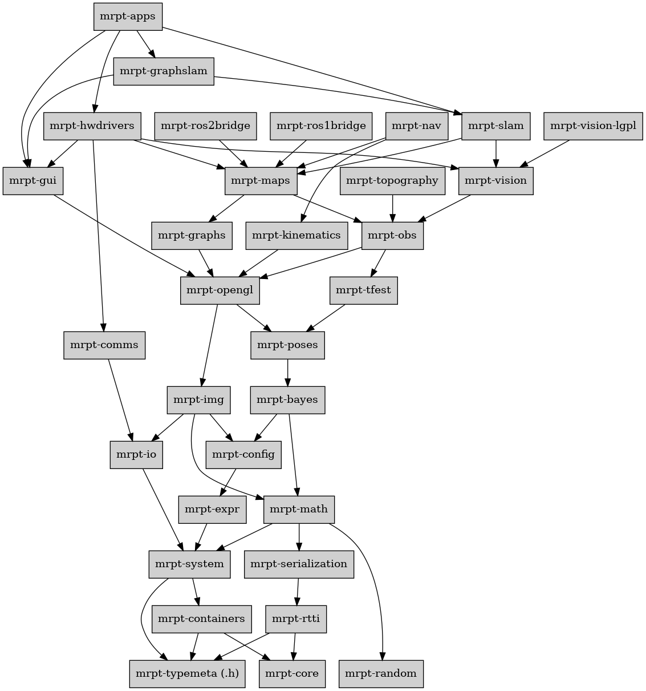

| Distro | Build dev | Release |
| --- | --- | --- |
| ROS 2 Humble (u22.04) | [](https://build.ros2.org/job/Hdev__mrpt_ros__ubuntu_jammy_amd64/) | [](https://index.ros.org/?pkgs=mrpt_ros&search_packages=true#humble) |
| ROS 2 Jazzy (u24.04) | [](https://build.ros2.org/job/Jdev__mrpt_ros__ubuntu_noble_amd64/) | [](https://index.ros.org/?pkgs=mrpt_ros&search_packages=true#jazzy) |
| ROS 2 Kilted (u24.04) | [](https://build.ros2.org/job/Kdev__mrpt_ros__ubuntu_noble_amd64/) | [](https://index.ros.org/?pkgs=mrpt_ros&search_packages=true#kilted) |
| ROS 2 Rolling (u24.04) | [](https://build.ros2.org/job/Rdev__mrpt_ros__ubuntu_noble_amd64/) | [](https://index.ros.org/?pkgs=mrpt_ros&search_packages=true#rolling) |

| EOL Distro | Last Release |
| --- | --- |
| ROS 1 Noetic @ u20.04 | [](https://index.ros.org/?pkgs=mrpt_ros&search_packages=true#noetic) |
| ROS 2 Iron (u22.04) | [](https://index.ros.org/search/?term=mrpt_ros) |

# DEPRECATED: Move to `mrpt3` as of May-2026

# mrpt-ros

## Migration guide: `mrpt_ros` (MRPT 2.x) → native MRPT 3.x packages

Starting with MRPT 3.0, the upstream [MRPT/mrpt](https://github.com/MRPT/mrpt) repository
is itself a colcon-friendly multi-package workspace, so the `mrpt_ros` wrapper is no longer
needed. Downstream ROS 2 packages should depend directly on the native `mrpt_<module>`
packages shipped by MRPT 3.x.

Package names do **not** collide: this old wrapper (mrpt_ros) uses the `mrpt_lib*` family, while
MRPT 3.x exposes one ROS package per C++ module (`mrpt_core`, `mrpt_math`, ...).

### 1. `package.xml` — dependency renaming

Replace every `<depend>mrpt_lib*</depend>` with the fine-grained module(s) actually used:

| `mrpt_ros` (2.x) | MRPT 3.x native packages |
|---|---|
| `mrpt_libbase`    | `mrpt_io`, `mrpt_serialization`, `mrpt_system`, `mrpt_rtti`, `mrpt_containers`, `mrpt_typemeta`, `mrpt_random`, `mrpt_config`, `mrpt_expr` |
| `mrpt_libmath`    | `mrpt_math` |
| `mrpt_libposes`   | `mrpt_poses` (+ `mrpt_tfest`, `mrpt_bayes` if used) |
| `mrpt_libobs`     | `mrpt_obs` (+ `mrpt_topography` if used) |
| `mrpt_libmaps`    | `mrpt_maps` (+ `mrpt_graphs` if used) |
| `mrpt_libopengl`  | `mrpt_opengl` (+ `mrpt_img`) |
| `mrpt_libgui`     | `mrpt_gui` |
| `mrpt_libnav`     | `mrpt_nav` (+ `mrpt_kinematics`) |
| `mrpt_libslam`    | `mrpt_slam` (+ `mrpt_vision`) |
| `mrpt_libhwdrivers` | `mrpt_hwdrivers` (+ `mrpt_comms`) |
| `mrpt_libapps`    | `mrpt_libapps_cli`, `mrpt_libapps_gui` |
| `mrpt_apps`       |  `mrpt_apps_cli` / `mrpt_apps_gui` |
| `mrpt_libtclap`   | **Removed, see below.** Migrate the CLI parsing in user code to [CLI11](https://github.com/CLIUtils/CLI11) (`cli11-dev` on Ubuntu/Debian) or an equivalent (e.g. `argparse`, `cxxopts`). |
| `python_mrpt`     | **Removed**: Each package now has its own pybind11-bindings. |

Example diff for a typical downstream package:

```diff
 <package format="3">
   <name>my_ros_node</name>
   ...
-  <depend>mrpt_libmath</depend>
-  <depend>mrpt_libposes</depend>
-  <depend>mrpt_libmaps</depend>
-  <depend>mrpt_libtclap</depend>
+  <depend>mrpt_math</depend>
+  <depend>mrpt_poses</depend>
+  <depend>mrpt_maps</depend>
+  <depend>cli11</depend>   <!-- replaces the dropped mrpt_libtclap; pick your preferred CLI lib -->
 </package>
```

### 2. `CMakeLists.txt` — `find_package` and target renaming

In MRPT 3.x, the CMake package names use underscores (matching the ROS package names) and
the exported imported targets are `mrpt::mrpt_<module>` (not `mrpt::<module>`):

```diff
-find_package(mrpt-math   REQUIRED)
-find_package(mrpt-poses  REQUIRED)
-find_package(mrpt-maps   REQUIRED)
-find_package(mrpt-tclap  REQUIRED)
+find_package(mrpt_math   REQUIRED)
+find_package(mrpt_poses  REQUIRED)
+find_package(mrpt_maps   REQUIRED)
+find_package(CLI11       REQUIRED)    # or argparse / cxxopts

 add_executable(my_node src/main.cpp)
 target_link_libraries(my_node PRIVATE
-  mrpt::math
-  mrpt::poses
-  mrpt::maps
-  mrpt::tclap
+  mrpt::mrpt_math
+  mrpt::mrpt_poses
+  mrpt::mrpt_maps
+  CLI11::CLI11
 )
```

The mechanical rules are:

- `find_package(mrpt-<X>)` → `find_package(mrpt_<X>)`
- `mrpt::<X>` → `mrpt::mrpt_<X>`

### 3. Dropped: `mrpt-tclap` / `mrpt_libtclap`

MRPT 3.x no longer vendors TCLAP. Downstream code that parsed command-line arguments via
`#include <mrpt/3rdparty/tclap/CmdLine.h>` must migrate to an externally-packaged CLI
library. The recommended replacement is [**CLI11**](https://github.com/CLIUtils/CLI11)
(single-header, actively maintained, packaged in Ubuntu as `libcli11-dev`, rosdep key
`cli11`). Alternatives: [`argparse`](https://github.com/p-ranav/argparse),
[`cxxopts`](https://github.com/jarro2783/cxxopts), or the system TCLAP package
(`libtclap-dev`) if you want to minimize code changes.

Minimal port sketch (TCLAP → CLI11):

```cpp
// Before (TCLAP, via the removed mrpt_libtclap):
#include <mrpt/3rdparty/tclap/CmdLine.h>
TCLAP::CmdLine cmd("my tool", ' ', "1.0");
TCLAP::ValueArg<std::string> arg_in("i", "input", "input file", true, "", "file", cmd);
cmd.parse(argc, argv);
const std::string in = arg_in.getValue();

// After (CLI11):
#include <CLI/CLI.hpp>
CLI::App app{"my tool"};
std::string in;
app.add_option("-i,--input", in, "input file")->required();
CLI11_PARSE(app, argc, argv);
```

### 4. Transition period

During the cutover, the legacy `mrpt_ros` packages will remain released on the ROS build
farm for already-released ROS distros, but no new features will land here. New downstream
releases should target MRPT 3.x directly.


## Mapping between ROS packages <==> MRPT C++ libraries

These are the `<depend>...</depend>` tags you need to include in
your project `package.xml` depending on [what C++ libraries you use](https://docs.mrpt.org/reference/latest/modules.html):

| ROS 2 package name  | Included MRPT libraries |
|---|---|
| `<depend>mrpt_libbase</depend>`    | mrpt-io, mrpt-serialization, mrpt-random, mrpt-system, mrpt-rtti, mrpt-containers, mrpt-typemeta, mrpt-core, mrpt-random, mrpt-config, mrpt-expr |
| `<depend>mrpt_libgui</depend>`    | mrpt-gui |
| `<depend>mrpt_libhwdrivers</depend>`    | mrpt-hwdrivers, mrpt-comms |
| `<depend>mrpt_libapps</depend>`    | mrpt-apps |
| `<depend>mrpt_libmaps</depend>`    | mrpt-maps, mrpt-graphs |
| `<depend>mrpt_libmath</depend>`    | mrpt-math |
| `<depend>mrpt_libnav</depend>`    | mrpt-nav, mrpt-kinematics |
| `<depend>mrpt_libobs</depend>`    | mrpt-obs, mrpt-topography |
| `<depend>mrpt_libopengl</depend>`    | mrpt-opengl, mrpt-img |
| `<depend>mrpt_libposes</depend>`    | mrpt-poses, mrpt-tfest, mrpt-bayes |
| `<depend>mrpt_libros_bridge</depend>`    | mrpt-ros2bridge (Moved to its own repo) |
| `<depend>mrpt_libslam</depend>`    | mrpt-slam, mrpt-vision |
| `<depend>mrpt_libtclap</depend>`    | mrpt-tclap |
| `<depend>mrpt_apps</depend>`    | Executable [applications](https://docs.mrpt.org/reference/latest/applications.html): RawLogViewer, rawlog-edit, rawlog-grabber, SceneViewer3D, etc. |
| `<depend>python_mrpt</depend>`    | [pymrpt wrapper](https://docs.mrpt.org/reference/latest/wrappers.html) |

Keep in mind that including one C++ library automatically includes all its dependencies, so you do not need to list them all:



## Usage

To get binary packages via `apt install` from the ROS build farm,
install required packages like:

```bash
sudo apt install ros-${ROS_DISTRO}-mrpt-libbase  # or any other as needed
```

Alternatively, if you need to build MRPT from sources (active MRPT developers & testers only),
clone this repo and build with colcon as usual:

```bash
cd ~/ros2_ws/src
git clone --recursive https://github.com/MRPT/mrpt_ros.git

cd ~/ros2_ws/
rosdep install --from-paths src --ignore-src -r -y

colcon build --symlink-install --parallel-workers 2 --cmake-args -DCMAKE_BUILD_TYPE=RelWithDebInfo
```

## Build status matrix

| Package |  ROS 2 Humble <br/> BinBuild |  ROS 2 Jazzy <br/> BinBuild | ROS 2 Kilted <br/> BinBuild | ROS 2 Rolling <br/> BinBuild |
| --- | --- | --- |--- |--- |
| mrpt_apps | [](https://build.ros2.org/job/Hbin_uJ64__mrpt_apps__ubuntu_jammy_amd64__binary/) | [](https://build.ros2.org/job/Jbin_uN64__mrpt_apps__ubuntu_noble_amd64__binary/) |[](https://build.ros2.org/job/Kbin_uN64__mrpt_apps__ubuntu_noble_amd64__binary/) |[](https://build.ros2.org/job/Rbin_uN64__mrpt_apps__ubuntu_noble_amd64__binary/) |
| mrpt_libapps | [](https://build.ros2.org/job/Hbin_uJ64__mrpt_libapps__ubuntu_jammy_amd64__binary/) | [](https://build.ros2.org/job/Jbin_uN64__mrpt_libapps__ubuntu_noble_amd64__binary/) |[](https://build.ros2.org/job/Kbin_uN64__mrpt_libapps__ubuntu_noble_amd64__binary/) |[](https://build.ros2.org/job/Rbin_uN64__mrpt_libapps__ubuntu_noble_amd64__binary/) |
| mrpt_libbase | [](https://build.ros2.org/job/Hbin_uJ64__mrpt_libbase__ubuntu_jammy_amd64__binary/) | [](https://build.ros2.org/job/Jbin_uN64__mrpt_libbase__ubuntu_noble_amd64__binary/) |[](https://build.ros2.org/job/Kbin_uN64__mrpt_libbase__ubuntu_noble_amd64__binary/) |[](https://build.ros2.org/job/Rbin_uN64__mrpt_libbase__ubuntu_noble_amd64__binary/) |
| mrpt_libgui | [](https://build.ros2.org/job/Hbin_uJ64__mrpt_libgui__ubuntu_jammy_amd64__binary/) | [](https://build.ros2.org/job/Jbin_uN64__mrpt_libgui__ubuntu_noble_amd64__binary/) |[](https://build.ros2.org/job/Kbin_uN64__mrpt_libgui__ubuntu_noble_amd64__binary/) |[](https://build.ros2.org/job/Rbin_uN64__mrpt_libgui__ubuntu_noble_amd64__binary/) |
| mrpt_libhwdrivers | [](https://build.ros2.org/job/Hbin_uJ64__mrpt_libhwdrivers__ubuntu_jammy_amd64__binary/) | [](https://build.ros2.org/job/Jbin_uN64__mrpt_libhwdrivers__ubuntu_noble_amd64__binary/) |[](https://build.ros2.org/job/Kbin_uN64__mrpt_libhwdrivers__ubuntu_noble_amd64__binary/) |[](https://build.ros2.org/job/Rbin_uN64__mrpt_libhwdrivers__ubuntu_noble_amd64__binary/) |
| mrpt_libmaps | [](https://build.ros2.org/job/Hbin_uJ64__mrpt_libmaps__ubuntu_jammy_amd64__binary/) | [](https://build.ros2.org/job/Jbin_uN64__mrpt_libmaps__ubuntu_noble_amd64__binary/) |[](https://build.ros2.org/job/Kbin_uN64__mrpt_libmaps__ubuntu_noble_amd64__binary/) |[](https://build.ros2.org/job/Rbin_uN64__mrpt_libmaps__ubuntu_noble_amd64__binary/) |
| mrpt_libmath | [](https://build.ros2.org/job/Hbin_uJ64__mrpt_libmath__ubuntu_jammy_amd64__binary/) | [](https://build.ros2.org/job/Jbin_uN64__mrpt_libmath__ubuntu_noble_amd64__binary/) |[](https://build.ros2.org/job/Kbin_uN64__mrpt_libmath__ubuntu_noble_amd64__binary/) |[](https://build.ros2.org/job/Rbin_uN64__mrpt_libmath__ubuntu_noble_amd64__binary/) |
| mrpt_libnav | [](https://build.ros2.org/job/Hbin_uJ64__mrpt_libnav__ubuntu_jammy_amd64__binary/) | [](https://build.ros2.org/job/Jbin_uN64__mrpt_libnav__ubuntu_noble_amd64__binary/) |[](https://build.ros2.org/job/Kbin_uN64__mrpt_libnav__ubuntu_noble_amd64__binary/) |[](https://build.ros2.org/job/Rbin_uN64__mrpt_libnav__ubuntu_noble_amd64__binary/) |
| mrpt_libobs | [](https://build.ros2.org/job/Hbin_uJ64__mrpt_libobs__ubuntu_jammy_amd64__binary/) | [](https://build.ros2.org/job/Jbin_uN64__mrpt_libobs__ubuntu_noble_amd64__binary/) |[](https://build.ros2.org/job/Kbin_uN64__mrpt_libobs__ubuntu_noble_amd64__binary/) |[](https://build.ros2.org/job/Rbin_uN64__mrpt_libobs__ubuntu_noble_amd64__binary/) |
| mrpt_libopengl | [](https://build.ros2.org/job/Hbin_uJ64__mrpt_libopengl__ubuntu_jammy_amd64__binary/) | [](https://build.ros2.org/job/Jbin_uN64__mrpt_libopengl__ubuntu_noble_amd64__binary/) |[](https://build.ros2.org/job/Kbin_uN64__mrpt_libopengl__ubuntu_noble_amd64__binary/) |[](https://build.ros2.org/job/Rbin_uN64__mrpt_libopengl__ubuntu_noble_amd64__binary/) |
| mrpt_libposes | [](https://build.ros2.org/job/Hbin_uJ64__mrpt_libposes__ubuntu_jammy_amd64__binary/) | [](https://build.ros2.org/job/Jbin_uN64__mrpt_libposes__ubuntu_noble_amd64__binary/) |[](https://build.ros2.org/job/Kbin_uN64__mrpt_libposes__ubuntu_noble_amd64__binary/) |[](https://build.ros2.org/job/Rbin_uN64__mrpt_libposes__ubuntu_noble_amd64__binary/) |
| mrpt_libslam | [](https://build.ros2.org/job/Hbin_uJ64__mrpt_libslam__ubuntu_jammy_amd64__binary/) | [](https://build.ros2.org/job/Jbin_uN64__mrpt_libslam__ubuntu_noble_amd64__binary/) |[](https://build.ros2.org/job/Kbin_uN64__mrpt_libslam__ubuntu_noble_amd64__binary/) |[](https://build.ros2.org/job/Rbin_uN64__mrpt_libslam__ubuntu_noble_amd64__binary/) |
| mrpt_libtclap | [](https://build.ros2.org/job/Hbin_uJ64__mrpt_libtclap__ubuntu_jammy_amd64__binary/) | [](https://build.ros2.org/job/Jbin_uN64__mrpt_libtclap__ubuntu_noble_amd64__binary/) |[](https://build.ros2.org/job/Kbin_uN64__mrpt_libtclap__ubuntu_noble_amd64__binary/) |[](https://build.ros2.org/job/Rbin_uN64__mrpt_libtclap__ubuntu_noble_amd64__binary/) |


## Motivation for this repository vs older `mrpt2` package
- Faster build times (for each individual package). It was common to see ROS build farms to time out.
- Finer grained dependencies: ROS users can now specify in their `<depend>` tags a part of MRPT only, not the whole thing.

So, **the ROS package `mrpt2` is obsolete now (Jul, 2024)**.

## License
BSD-3
